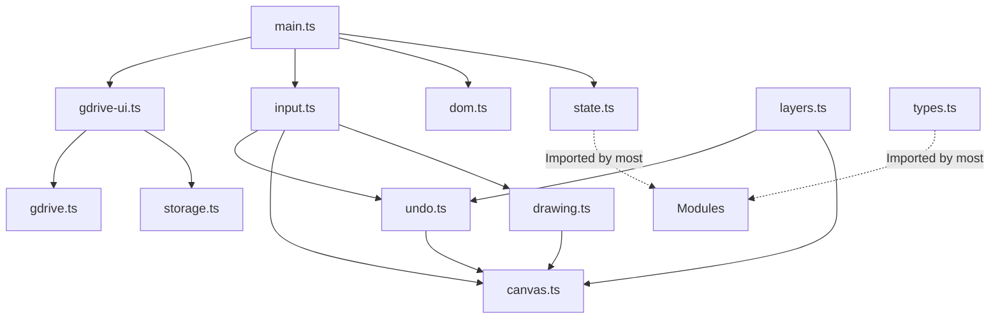

# Paint App Architecture

このドキュメントは、Paintアプリの現在のコード構造、モジュール構成、およびデータフローをまとめたものです。今後の機能追加やバグ修正の際のガイドとして機能します。

## 1. 全体構造 (Overview)

このプロジェクトは TypeScript と Vite をベースに構築されたブラウザベースのペイントアプリです。Google ドライブとの同期機能、レイヤー機能、マルチタッチジェスチャー（ピンチズーム・タップでのUndo/Redoなど）をサポートしています。

すべてのロジックは `src` ディレクトリ以下にモジュール化して配置されており、`main.ts` がエントリーポイントとして各モジュールを統合しています。

## 2. モジュール構成 (Modules)

### 2.1 コアデータと状態管理
* **`types.ts`**: アプリケーション全体で使用する共通の型定義（`Point`, `Layer`, `UndoEntry`, `TapRecord` など）。
* **`state.ts`**: アプリケーションのグローバルな状態（キャンバスのサイズ、現在のツール、選択中の色、レイヤー一覧、ビューの拡縮率・オフセットなど）。すべての可変な状態はここに集約され、`getter/setter` を通じてアクセスされます。
* **`dom.ts`**: HTMLテンプレートの挿入と、DOM要素（ボタン、キャンバス、入力フィールドなど）の参照エクスポートを行います。

### 2.2 描画とキャンバス制御
* **`canvas.ts`**: メインの描画領域の初期化、レイヤー合成（`compositeAndDisplay`）、サムネイル生成などを担当します。クリッピングマスクの合成処理もここで行われます。
* **`drawing.ts`**: ペンや消しゴムによる実際の描画処理。ストロークのスムージング（手ぶれ補正）アルゴリズムや、OKLCHベースのカラー計算ロジックを含みます。

### 2.3 操作とUI
* **`input.ts`**: ユーザーからの入力イベント（マウス、ペン、タッチ）の処理。ピンチズームやパン操作、2本指タップでのUndo、3本指タップでのRedoなどのジェスチャー検出を行います。
* **`layers.ts`**: レイヤーの追加・削除、順序入れ替え（ドラッグ＆ドロップ）、クリッピングマスクの切り替え処理。およびレイヤーパネルのUIレンダリングを担当します。

### 2.4 データ保存と履歴
* **`undo.ts`**: Undo/Redo の履歴スタックの管理。ストローク描画、レイヤーの追加/削除/並び替え/クリッピング変更など、全てのアクションの状態を記録し復元します。
* **`storage.ts`**: ブラウザの `localStorage` へのデータ保存、読み込み、使用量の管理を行います。
* **`gdrive.ts`**: Google Identity Services (GIS) および Google Drive API との通信ロジック（認証、ファイルのアップロード/ダウンロード/削除）。
* **`gdrive-ui.ts`**: Googleドライブ連携のUI制御、ローカルデータからドライブへのマイグレーション処理、ステータス表示などを担当します。

## 3. データの流れ (Data Flow)

### 3.1 描画のフロー
1. ユーザーが画面にタッチ/クリックする (`input.ts`)
2. 座標が論理キャンバス座標に変換され、描画状態が記録される (`undo.ts`)
3. `PointerMove` イベントでスムージングアルゴリズムが座標を計算 (`drawing.ts`)
4. アクティブなレイヤーの Canvas context に線分を描画 (`drawing.ts`)
5. すべてのレイヤーを下から上へ合成し、メインディスプレイの Canvas に表示 (`canvas.ts` の `compositeAndDisplay`)

### 3.2 Undo/Redo のフロー
* **記録**: アクションが発生する直前に、対象レイヤーの `ImageData` や状態をコピーし、`undoStack` にPushします。
* **復元**: 2本指タップやCtrl+Zで `performUndo()` が呼ばれると、`undoStack` からエントリを取り出し、現在の状態を `redoStack` に保存した上で、過去の `ImageData` やレイヤー状態を復元し、再描画します。

## 4. 今後の開発に向けたガイドライン

1. **状態の追加**: 新しい状態（ツール設定など）を追加する場合は、必ず `state.ts` に追加し、getter/setterを用意してください。
2. **循環参照の回避**: モジュール間の循環参照（例: `layers.ts` と `undo.ts` がお互いを呼び出す）を防ぐため、依存関係は一方向にするか、`setRenderLayerList` のように関数を注入（Dependency Injection）する仕組みを利用してください。
3. **新規UIの追加**: 新しいUI要素を追加する場合は、`dom.ts` にテンプレートと要素の取得処理を追加し、各モジュールでそれをインポートしてリスナーを登録する形を取ります。
